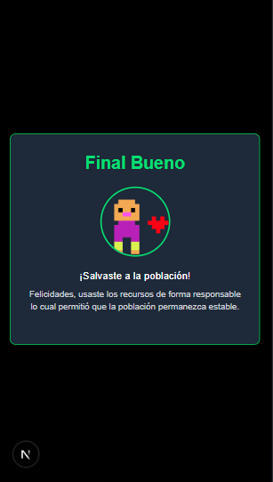

# Juego Interactivo de Bioética para Presentaciones

Este repositorio contiene un juego interactivo diseñado para enriquecer presentaciones sobre bioética y dilemas morales. La herramienta plantea una pregunta simple pero profunda: con una población a tu cargo, **¿decides alimentarla o no?**

La decisión de cada participante impacta un resultado colectivo, generando finales visuales que sirven como un poderoso punto de partida para el debate y la reflexión.

## Capturas de Pantalla

| Pantalla de Bienvenida | Juego Principal | Panel de Administrador | Resultados |
| :---: | :---: | :---: | :---: |
|  |  |  |  |

| Final Bueno | Final Malo |
| :---: | :---: |
|  |  |

## Características

*   **Para la Audiencia:** Una interfaz simple y directa con una única decisión crucial.
*   **Finales Dinámicos:** Los participantes reciben un "final bueno" (población salvada) o un "final malo" (hambruna) basado en su elección.
*   **Panel de Administración (`/admin`):** Permite al presentador tener control total sobre el flujo del juego.
*   **Control de Sesión:** Activa el juego para que la audiencia pueda votar y desactívalo para revelar los resultados simultáneamente a todos.
*   **Visualización de Resultados (`/results`):** Muestra en tiempo real un conteo de cuántos usuarios eligieron cada opción, ideal para discutir en grupo.

## Flujo de Uso en una Presentación

1.  **Preparación:** El presentador accede al panel en la ruta `/admin`.
2.  **Activación:** El presentador pulsa **"Activar Juego"**. En ese momento, el juego está listo para que los participantes entren.
3.  **Inicio:** Se comparte el enlace principal del juego con la audiencia.

4.  **Experimentación:** La audiencia decide si alimenta su población o no.
5.  **Cierre:** Una vez que la mayoría han actuado, el presentador pulsa **"Desactivar Juego"**.
6.  **Revelación:** Al desactivarse, cada participante ve en su pantalla el final correspondiente a su decisión.
7.  **Discusión:** El presentador comparte la pantalla de `/results` para mostrar las estadísticas y facilitar un debate sobre las elecciones del grupo.

## Instalación y Puesta en Marcha

Para usar este proyecto en tu propio hosting, sigue estos pasos:

1.  **Crear un Proyecto en Firebase:**
    *   Ve a la [Consola de Firebase](https://console.firebase.google.com/).
    *   Crea un nuevo proyecto.
    *   Dentro de tu proyecto, crea una nueva aplicación web (haz clic en el ícono `</>`).
    *   Copia el objeto de configuración `firebaseConfig` que se te proporcionará.

2.  **Configurar el Proyecto:**
    *   Clona o descarga este repositorio.
    *   Abre el archivo `lib/firebase.ts`.
    *   Reemplaza el objeto `firebaseConfig` de ejemplo con las claves de tu propio proyecto.

3.  **Desplegar los Archivos:**
    *   Sube todos los archivos estáticos (HTML, CSS, JS, imágenes, etc.) a tu servicio de hosting preferido. Algunas opciones excelentes y gratuitas son:
        *   [Firebase Hosting](https://firebase.google.com/docs/hosting)
        *   [Vercel](https://vercel.com/)
        *   [Netlify](https://www.netlify.com/)
        *   [GitHub Pages](https://pages.github.com/)

¡Y listo! Ya puedes utilizar la herramienta en tus presentaciones.

Puedes probar la aplicación aqui: [Demo]( https://elkofix.github.io/bioethics-hook-game/)
